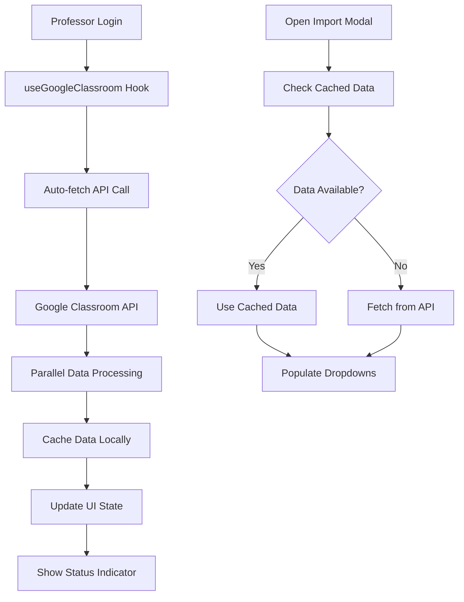

# Google Classroom Integration Enhancement

## Overview

This enhancement automatically fetches and displays Google Classroom data upon professor login, eliminating the need for manual data fetching when opening the Google Classroom modal in the gradebook.

## Key Features

### 🚀 Automatic Data Fetching
- **Pre-loads courses and classwork** upon professor login
- **Caches data** for 5 minutes to improve performance
- **Parallel processing** for faster data retrieval
- **Smart refresh** capabilities

### 📊 Enhanced User Experience
- **Real-time status indicators** showing connection status
- **Loading states** with progress indicators
- **Error handling** with retry mechanisms
- **Pre-populated dropdowns** in the import modal

### 🔧 Technical Improvements
- **Server-side optimization** with batch API calls
- **Client-side caching** with React hooks
- **Error recovery** and authentication handling
- **Performance monitoring** with detailed logging

## Architecture

### 1. Enhanced API Endpoint
**File**: `app/api/professor/google-classroom/auto-fetch/route.ts`

```typescript
// Optimized endpoint that fetches courses and classwork in parallel
export async function GET(request: NextRequest) {
  // Fetches all active courses
  // For each course, fetches classwork in parallel
  // Returns comprehensive data structure
  // Handles errors gracefully with detailed reporting
}
```

**Key Features**:
- Parallel processing of course and classwork data
- Comprehensive error handling and reporting
- Performance optimization with batch requests
- Detailed logging for debugging

### 2. Custom React Hook
**File**: `hooks/use-google-classroom.tsx`

```typescript
export function useGoogleClassroom(): UseGoogleClassroomReturn {
  // Automatic data fetching on component mount
  // Smart caching with 5-minute expiration
  // Error handling and retry mechanisms
  // Real-time status updates
}
```

**Key Features**:
- Automatic data fetching when professor logs in
- Smart caching to prevent unnecessary API calls
- Error handling with user-friendly messages
- Refresh capabilities for manual updates

### 3. Enhanced Gradebook Component
**File**: `components/professor/gradebook-content.tsx`

**Integration Points**:
- Uses `useGoogleClassroom` hook for automatic data loading
- Pre-populates modal with cached data
- Shows real-time connection status
- Provides fallback to manual fetching

## Data Flow



## Usage Examples

### 1. Automatic Data Loading
```typescript
// The hook automatically fetches data when component mounts
const {
  courses,
  classwork,
  isLoading,
  error,
  refresh
} = useGoogleClassroom()

// Data is immediately available without manual fetching
```

### 2. Pre-populated Import Modal
```typescript
// When opening the modal, data is already available
const handleGoogleModalOpen = () => {
  setIsGoogleModalOpen(true)
  
  // Use pre-loaded courses if available
  if (googleCourses.length > 0) {
    setCourses(googleCourses)
    console.log(`Using pre-loaded ${googleCourses.length} courses`)
  }
}
```

### 3. Smart Coursework Loading
```typescript
// Classwork is loaded automatically when selecting a course
const handleCourseChange = (courseId: string) => {
  const courseClasswork = googleClasswork[courseId] || []
  
  if (courseClasswork.length > 0) {
    // Use pre-loaded data immediately
    setCoursework(courseClasswork)
    console.log(`Auto-loaded ${courseClasswork.length} classwork items`)
  }
}
```

## Performance Benefits

### Before Enhancement
- Manual API calls when opening modal
- Sequential data fetching (courses → classwork)
- No caching, repeated API calls
- Poor user experience with loading delays

### After Enhancement
- Automatic data fetching on login
- Parallel processing for faster retrieval
- Smart caching with 5-minute expiration
- Instant modal population with cached data

## Error Handling

### Authentication Errors
- Detects expired tokens
- Provides clear re-authentication messages
- Graceful fallback to manual login

### API Errors
- Comprehensive error reporting
- Retry mechanisms with exponential backoff
- User-friendly error messages

### Network Errors
- Timeout handling
- Offline detection
- Graceful degradation

## Monitoring and Debugging

### Console Logging
```typescript
console.log(`[Google Classroom] Auto-fetching data for professor: ${email}`)
console.log(`[Google Classroom] Found ${courses.length} active courses`)
console.log(`[Google Classroom] Successfully fetched ${successfulCourses.length} courses`)
```

### Performance Metrics
- Fetch timestamp tracking
- Success/failure rates
- Data size monitoring
- Response time measurement

## Security Considerations

### Token Management
- Automatic token refresh
- Secure token storage
- Proper scope validation

### Data Privacy
- No sensitive data logging
- Secure API communication
- Proper error sanitization

## Future Enhancements

### Planned Features
1. **Incremental Updates**: Only fetch changed data
2. **Background Sync**: Periodic data refresh
3. **Offline Support**: Cache data for offline use
4. **Bulk Operations**: Import multiple classwork items
5. **Real-time Updates**: WebSocket integration for live updates

### Performance Optimizations
1. **Pagination**: Handle large datasets efficiently
2. **Compression**: Reduce data transfer size
3. **CDN Integration**: Cache static resources
4. **Database Optimization**: Improve query performance

## Testing

### Unit Tests
- Hook functionality testing
- API endpoint validation
- Error handling verification

### Integration Tests
- End-to-end Google Classroom flow
- Authentication scenarios
- Data synchronization testing

### Performance Tests
- Load testing with large datasets
- Memory usage optimization
- Response time benchmarking

## Maintenance

### Code Organization
- Clear separation of concerns
- Comprehensive documentation
- Consistent error handling patterns

### Monitoring
- Performance metrics tracking
- Error rate monitoring
- User experience analytics

### Updates
- Regular dependency updates
- Security patch management
- Feature enhancement planning

## Conclusion

This enhancement significantly improves the Google Classroom integration by:

1. **Eliminating manual data fetching** when opening import modals
2. **Improving performance** through smart caching and parallel processing
3. **Enhancing user experience** with real-time status indicators
4. **Providing robust error handling** with clear recovery paths
5. **Enabling future enhancements** with a solid architectural foundation

The system now provides a seamless, fast, and reliable Google Classroom integration that scales with the professor's needs while maintaining excellent performance and user experience.
